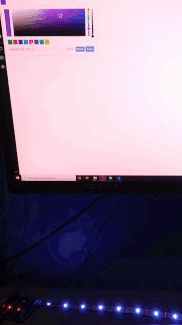
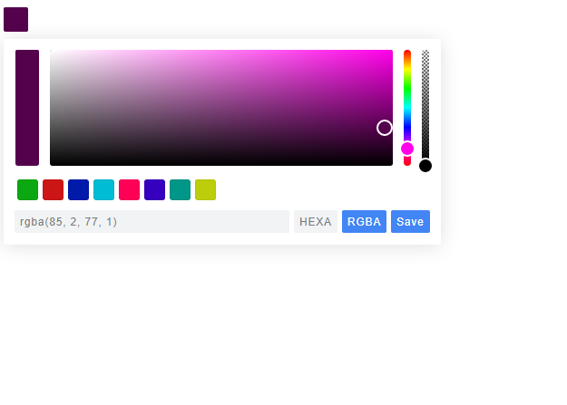

# Led Color Picker

Find the rgb code for your led strip using a color picker, an Arduino and NodeJs. 



Since i'm to lazy to do frontend [pickr](https://github.com/simonwep/pickr) were used (and because i think it looks nice).

## Preparation
* Upload the code into Arduino 

### Prepare to run the server

  * In the folder run
```
npm install
```
  * Open Index.js and edit that part
```js
const portName = "Your Arduino Port"
```
  * If you don't know your port name uncomment this line

```js
(async()=>{console.log(await SerialPort.list())})()
```
 * Then run the code bellow  and copy the Path

```js
node index.js
```

## Usage

Start the server

```js
node index.js
```
 open ***index.html*** File, select the color and press save.



Simple like that! I think...


## Contributing
Pull requests are welcome. For major changes, please open an issue first to discuss what you would like to change.

Please make sure to update tests as appropriate.

## License
[MIT](https://choosealicense.com/licenses/mit/)
